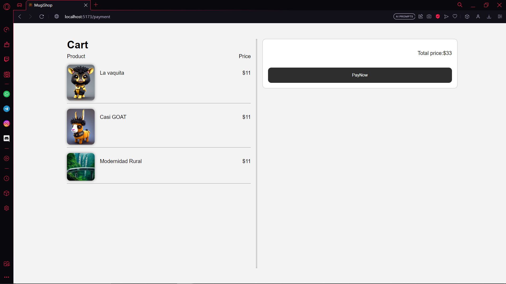

# MugiShop (Frontend):
+ Ecommerce de imágenes: React, CSS, Zod y hooks-form. Ofrece fotos digitales de calidad con validación de datos y formularios eficientes en React. Diseño atractivo con CSS. Gestiona pedidos y perfiles de usuario. Experiencia de compra segura y intuitiva.
+ ### ¿Para que sirve?
  + Este proyecto tiene como finalidad la compra de "NTFS" 

## Imagenes del proyecto
 + ### Home Page


 + ### Payment Page


## Instalar dependecias
```
npm i
```

## Correr servidor
``` 
npm run dev
```

### Stack
 + React
 + CSS3
 + zod
 + HooksForm
